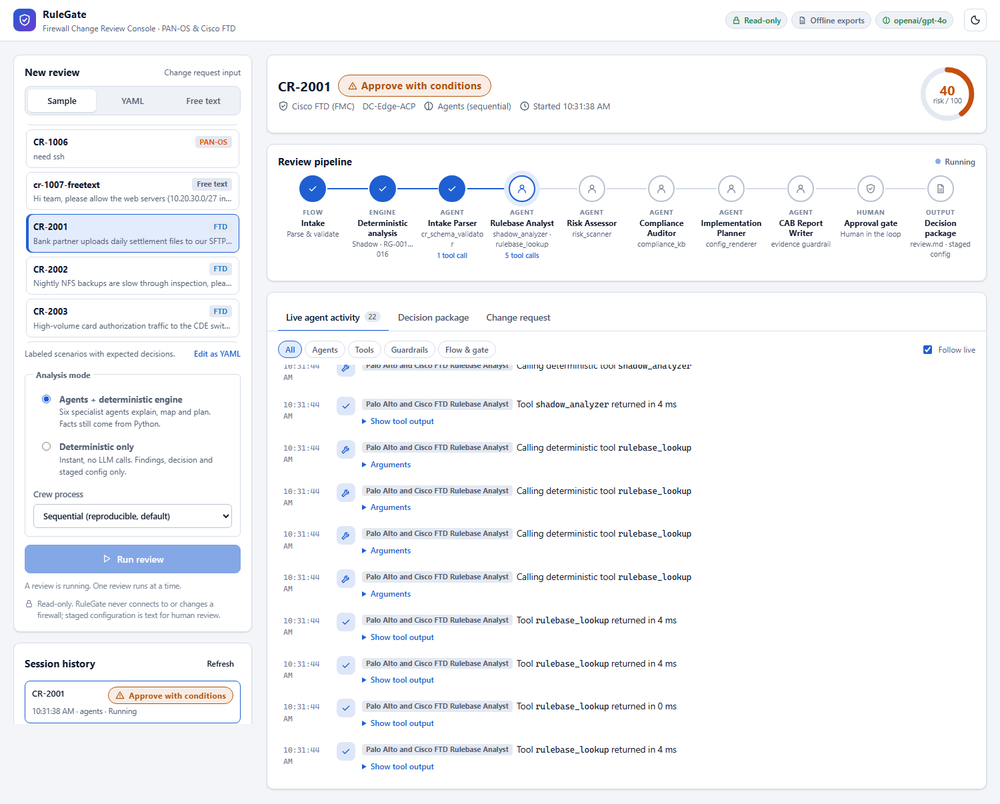
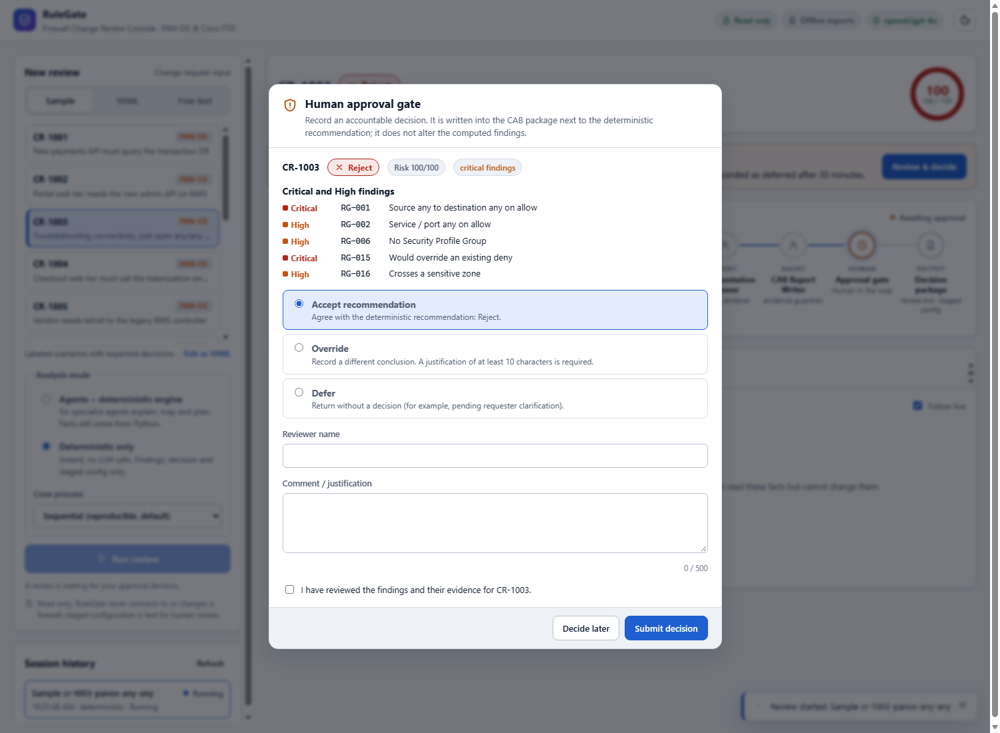
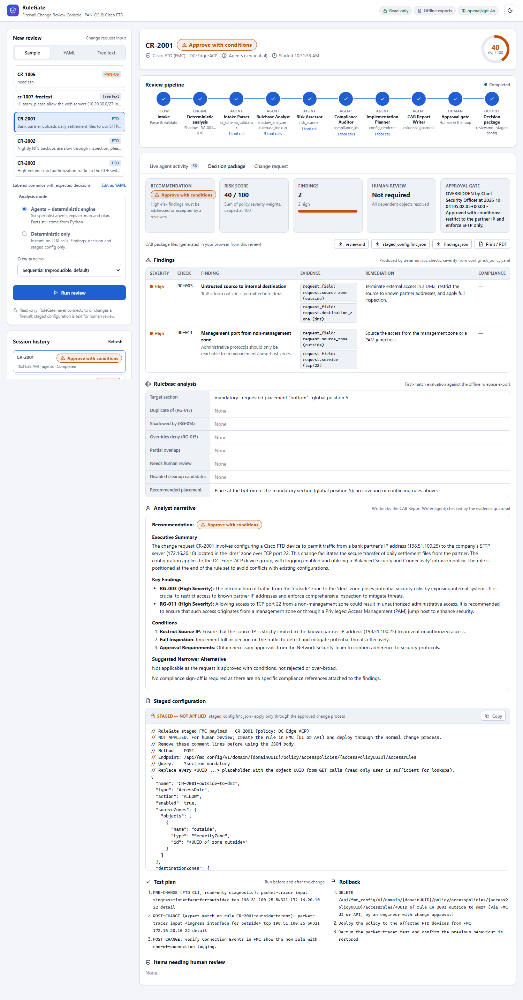
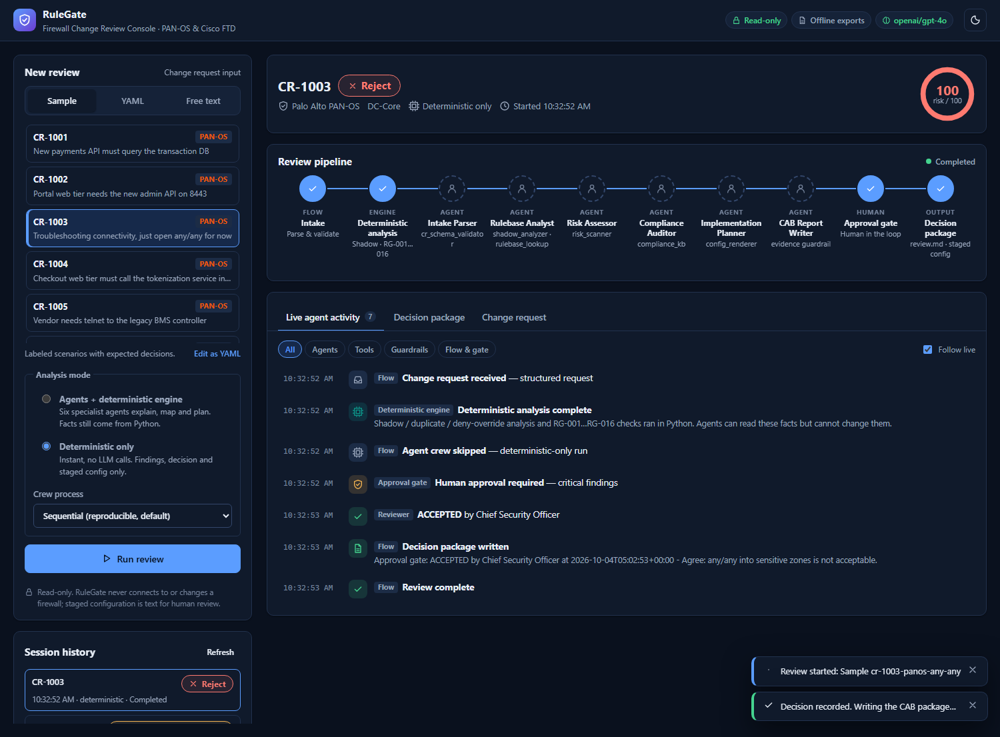
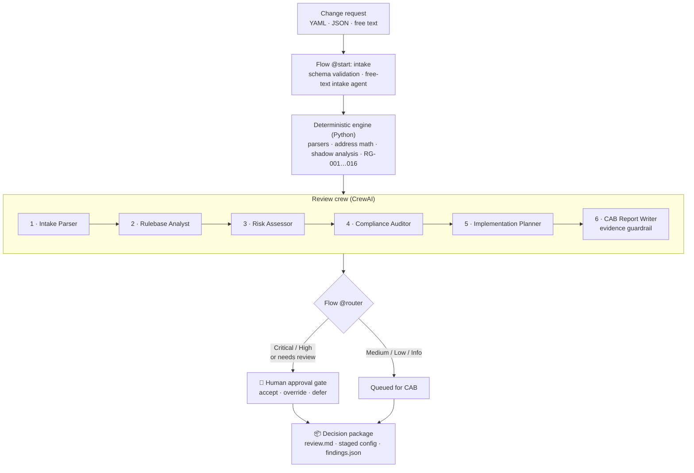

<div align="center">

# 🛡️ RuleGate

### Multi-Agent Firewall Change Request Reviewer

**Evidence-backed, risk-scored reviews of Palo Alto PAN-OS and Cisco FTD firewall changes before they reach the CAB, built with [CrewAI](https://www.crewai.com/).**


[Quick start](#-quick-start) · [Review console](#-review-console-web-ui) · [How it works](#-how-it-works) · [Risk checks](#-risk-check-catalog) · [Security](#-safety-and-security-model) · [Roadmap](#-roadmap)

</div>

---



> **RuleGate never changes a firewall.** It reads the current rulebase, analyses the proposed change, and gives a human engineer a **decision package**: a recommendation (approve, approve with conditions, or reject), a findings report with evidence, staged vendor configuration, a test plan, and a rollback plan.

---

## 📑 Table of contents

- [Why RuleGate](#-why-rulegate)
- [Key features](#-key-features)
- [Quick start](#-quick-start)
- [Review console (web UI)](#-review-console-web-ui)
- [Command-line usage](#-command-line-usage)
- [How it works](#-how-it-works)
- [The agent crew](#-the-agent-crew)
- [Risk check catalog](#-risk-check-catalog)
- [Vendor support](#-vendor-support)
- [Change request format](#-change-request-format)
- [Sample output](#-sample-output)
- [Safety and security model](#-safety-and-security-model)
- [Configuration reference](#-configuration-reference)
- [Testing and evaluation](#-testing-and-evaluation)
- [Project structure](#-project-structure)
- [Roadmap](#-roadmap)
- [Extending RuleGate](#-extending-rulegate)
- [License and author](#-license)

---

## 🎯 Why RuleGate

Firewall change requests in most enterprises follow a familiar pattern:

| The problem | What it costs |
|---|---|
| Requesters ask for broader access than they need ("just open any/any for now") | Over-permissive rules that never get removed |
| Nobody checks whether the access **already exists**, or whether the new rule will be **shadowed** | Duplicate rules, dead rules, rulebase sprawl |
| Hygiene is skipped under time pressure: no App-ID, no security profiles, no intrusion policy | Allowed traffic that is never inspected |
| PAN-OS and FTD have different semantics (zones, NAT, inspection actions) | Double the review effort in multi-vendor estates |
| CAB documentation (risk, test plan, rollback) is written by hand | Inconsistent, unauditable approvals |

RuleGate automates the analysis a senior firewall engineer does in their head, and **shows its work** so a human can approve with confidence.

---

## ✨ Key features

- **Deterministic first, LLM second.** CIDR containment, port-range overlap, object resolution, first-match shadow analysis and all 16 risk checks are pure, unit-tested Python. Agents explain and plan; they never compute facts.
- **Six specialist agents.** Intake, rulebase analysis, risk assessment, compliance mapping, implementation planning and CAB report writing, run as a CrewAI crew (sequential or hierarchical).
- **Evidence-bound findings.** Every finding carries a check ID and evidence (a rule, object or request field). A guardrail rejects any narrative that cites an unknown check, names an unrelated rule, omits a Critical/High finding, or changes the decision.
- **Duplicate, shadow and deny-override detection.** Evaluates the real rule order: Panorama pre/local/post rules, and FTD Prefilter, then ACP mandatory and default sections, then the default action.
- **Vendor-specific staged configuration.** PAN-OS `set` commands with placement, or an FMC REST payload, plus pre/post-change tests and a rollback, all written as text for human review.
- **Human approval gate.** Critical, High, or unresolvable results pause for an accountable reviewer to accept, override with justification, or defer.
- **Review console.** A hardened local web UI that streams every agent step and tool call live, with the approval gate and a downloadable decision package.
- **Compliance mapping.** Findings map to an internal firewall standard, PCI DSS Requirement 1, CIS and IEC 62443 (sample knowledge base included).
- **Flags, never guesses.** FQDN objects, dynamic address groups, EDLs, unknown services and user-based rules are marked `UNRESOLVED` and routed to human review.

---

## 🚀 Quick start

### Prerequisites

- Python **3.11–3.13**
- [`uv`](https://docs.astral.sh/uv/) (recommended) or pip
- An LLM API key (OpenAI, Anthropic, Azure OpenAI, or a local model via Ollama). This is **optional** for deterministic-only reviews.

### Install

```bash
git clone https://github.com/natrajexplore/CrewAI_FW_CHG_Reviewer.git
cd CrewAI_FW_CHG_Reviewer
uv sync --group dev        # or: pip install -e . pytest httpx
cp .env.example .env       # then set MODEL and your API key
```

### Configure `.env`

```ini
MODEL=openai/gpt-4o                 # or anthropic/claude-sonnet-5-5, azure/..., ollama/...
OPENAI_API_KEY=sk-...               # or ANTHROPIC_API_KEY=...
RULEGATE_MODE=offline
```

> `MODEL` is required for the agents. Without it you can still run **deterministic-only** reviews (`--no-llm`, or "Deterministic only" in the console).

### Try it in 30 seconds

```bash
# Web console: open the printed http://127.0.0.1:8000/#token=... link
uv run rulegate serve

# Or the CLI, with no API key needed:
uv run rulegate review samples/change_requests/cr-1003-panos-any-any.yaml --no-llm
```

---

## 🖥️ Review console (web UI)

`rulegate serve` starts a local console for watching the agents work as a firewall reviewer and for recording the human decision.

```bash
uv run rulegate serve              # binds 127.0.0.1:8000 and prints a one-time access link
uv run rulegate serve --port 8080
```

| | |
|---|---|
| **1. Choose a request:** pick a labeled sample, paste or edit YAML, or write a free-text request. Choose *Agents + deterministic engine* or *Deterministic only* (instant, no LLM). | **2. Watch the review:** a live pipeline (Intake → Deterministic analysis → six agents → Approval gate → Decision package) and an activity feed of every task, tool call (with arguments and output), and guardrail check. |
| **3. Decide at the gate:** Critical/High results pause for a reviewer to **accept**, **override** (justification required) or **defer**, with an attestation that the evidence was reviewed. | **4. Take the package:** recommendation, risk score, findings with evidence and compliance references, rulebase analysis, narrative, staged config, test plan and rollback. Download `review.md`, the staged config and `findings.json`, or print to PDF. |

<details>
<summary><b>📸 Approval gate</b></summary>



</details>

<details>
<summary><b>📸 Decision package (live agent run)</b></summary>



</details>

<details>
<summary><b>📸 Dark mode</b></summary>



</details>

The console supports light and dark themes, keyboard navigation and screen-reader labels, and adapts to narrow screens. Undecided approvals are recorded as deferred after 30 minutes. See [Review console security controls](#review-console-security-controls) for how it is hardened.

---

## ⌨️ Command-line usage

```bash
# Palo Alto change request (full agent crew)
uv run rulegate review samples/change_requests/cr-1001-panos-web-to-db.yaml

# Cisco FTD change request
uv run rulegate review samples/change_requests/cr-2001-ftd-vendor-sftp.yaml

# Hierarchical mode: a Lead Security Architect manager delegates to the specialists
uv run rulegate review samples/change_requests/cr-1003-panos-any-any.yaml --process hierarchical

# Free-text request (an intake agent normalizes it and lists its assumptions)
uv run rulegate review samples/change_requests/cr-1007-freetext.txt --vendor panos

# Deterministic only: no LLM calls, no API key
uv run rulegate review samples/change_requests/cr-1003-panos-any-any.yaml --no-llm
```

Each run writes `reports/<CR-ID>/review.md`, `staged_config.set` (PAN-OS) or `staged_config.fmc.json` (FTD), and `findings.json`.

| Option | Purpose |
|---|---|
| `--rulebase PATH` | Offline rulebase export (default: the sample for the CR's vendor) |
| `--policy PATH` | Risk policy YAML (default `config/risk_policy.yaml`) |
| `--vendor {panos,ftd}` | Vendor hint for free-text requests |
| `--process {sequential,hierarchical}` | Crew process (default `sequential`, for reproducibility) |
| `--no-llm` | Skip the agent crew; the report contains only deterministic results |
| `--non-interactive` | Don't prompt at the approval gate; the report is marked `PENDING human approval` |
| `--output-dir DIR` | Report directory (default `reports`) |

`rulegate serve` options: `--host` (default `127.0.0.1`), `--port` (default `8000`), and `--allow-remote` (required for a non-loopback bind; put a TLS reverse proxy in front).

---

## 🧠 How it works



### Design principle: deterministic first, LLM second

LLMs are unreliable at CIDR math and port-range comparison, so RuleGate splits the work:

| Python does the facts | Agents do the judgement |
|---|---|
| Subnet containment (`ipaddress`), IPv4/IPv6 aware | Interpret the business justification |
| Port-range and App-ID `application-default` expansion | Explain findings in plain English |
| Recursive, cycle-safe object and group resolution | Map findings to policy and compliance clauses |
| First-match duplicate / shadow / deny-override analysis | Present the placement, test plan and rollback |
| All 16 risk checks, score and decision | Write the CAB narrative and narrower alternatives |

Agents read facts only through **tools bound to the request under review**, so they cannot feed in their own rule or request data. Severity comes from `config/risk_policy.yaml`; agents can add context but **cannot change a severity or the decision**.

---

## 🤖 The agent crew

| # | Agent | Responsibility | Tools |
|---|---|---|---|
| 1 | **Change Intake Parser** | Summarizes the request; flags missing fields (justification, ticket, expiry, exact ports) and clarification questions | `cr_schema_validator` |
| 2 | **Rulebase Analyst** | Reports duplicates, shadowing, deny overrides, partial overlaps and items needing human review; recommends placement | `shadow_analyzer`, `rulebase_lookup` |
| 3 | **Risk Assessor** | Explains every RG-xxx finding in business terms, keeping check ID and severity exactly as computed | `risk_scanner` |
| 4 | **Compliance Auditor** | Maps findings to the internal standard, PCI DSS, CIS and IEC 62443 clauses; names required sign-offs | `compliance_kb` |
| 5 | **Implementation Planner** | Presents the staged config, pre/post-change tests, rollback and the conditions for applying it | `config_renderer` |
| 6 | **CAB Report Writer** | Writes the narrative: recommendation, key findings, conditions or rejection reasons, narrower alternative | evidence guardrail |
| ⚙️ | *Lead Security Architect* | Manager agent, used only in `--process hierarchical` | delegation |

Analysis agents run at temperature 0.1; the report writer at 0.3. The findings table, rulebase analysis, staged config, test plan and rollback in the final report are **rendered deterministically**; only the narrative is LLM-written, and it must pass the guardrail.

---

## 📋 Risk check catalog

Checks live in [`src/rulegate/analysis/risk_rules.py`](src/rulegate/analysis/risk_rules.py). Thresholds, zones, port lists and severities are configurable in [`config/risk_policy.yaml`](config/risk_policy.yaml).

| ID | Check | Vendor | Default severity |
|---|---|---|---|
| RG-001 | Source **any** and destination **any** on an allow rule | All | 🔴 Critical |
| RG-002 | Service / port **any** on an allow rule | All | 🟠 High |
| RG-003 | Untrust / outside source to an internal destination | All | 🟠 High |
| RG-004 | Overly broad CIDR (default: /16 or broader for IPv4, /48 for IPv6) | All | 🟡 Medium |
| RG-005 | Application `any` (port-based rule where App-ID is possible) | PAN-OS | 🟡 Medium |
| RG-006 | Allow rule without a Security Profile Group | PAN-OS | 🟠 High |
| RG-007 | Allow rule without an Intrusion Policy (and File Policy for HTTP/FTP/SMB/SMTP) | FTD | 🟠 High |
| RG-008 | **Trust** action in ACP (Medium) or Prefilter **Fastpath** (High): inspection bypass | FTD | 🟡/🟠 |
| RG-009 | Logging disabled | All | 🟡 Medium |
| RG-010 | Cleartext or legacy protocols (telnet and FTP always; HTTP and SMB from untrust) | All | 🟠 High |
| RG-011 | Management ports (22, 3389, SNMP, 443 to management) from non-management zones | All | 🟠 High |
| RG-012 | Missing justification, ticket, or expiry on a temporary request | All | 🔵 Low |
| RG-013 | Requested access is **already permitted** by an existing rule | All | ⚪ Info |
| RG-014 | New rule would be **shadowed** by a rule above its placement | All | 🟠 High |
| RG-015 | New rule would **override an explicit deny** | All | 🔴 Critical |
| RG-016 | Crosses a sensitive zone (PCI / CDE / OT / management) | All | 🟠 High + compliance |

### Decision logic

Evaluated top to bottom; the first matching row wins.

| Condition | Recommendation |
|---|---|
| Any **Critical** finding | `REJECT`, with a suggested narrower alternative |
| RG-013 duplicate access | `REJECT_DUPLICATE`: no change needed |
| Any **High** finding | `APPROVE_WITH_CONDITIONS`, which goes to the human gate |
| Only Medium / Low / Info | `APPROVE` |

**Risk score:** the sum of the policy `severity_weights` (Critical 40, High 20, Medium 10, Low 5), capped at 100. Results that depend on `UNRESOLVED` objects set `needs_human_review`, which also routes the request to the approval gate.

---

## 🔌 Vendor support

| Capability | Palo Alto (PAN-OS / Panorama) | Cisco FTD (via FMC) |
|---|---|---|
| Offline rulebase import | Running-config XML (Panorama device groups or firewall vsys) | FMC export: prefilter + access rules (`expanded=true`) + objects |
| Evaluation order | Pre-rulebase → local → post-rulebase | Prefilter → ACP mandatory → ACP default → default action |
| NAT semantics | **Pre-NAT IP**, **post-NAT zone** | **Real (untranslated) IP** |
| Objects | Address, groups (static/dynamic), services, service groups, EDLs | Networks, groups, port objects, FQDN and dynamic objects |
| Inspection checks | Security Profile Group / profiles | Intrusion policy, file policy, Trust vs Allow, Fastpath |
| Staged output | `set` commands + `move` placement (`staged_config.set`) | FMC REST `accessrules` / `prefilterrules` JSON (`staged_config.fmc.json`) |
| Read-only live API | Phase 4 (read-only admin role) | Phase 4 (read-only user role) |

> **FTD note:** FTD access policy is managed by FMC (or FDM), not the device CLI, so RuleGate generates FMC API payloads rather than `configure terminal` commands.

---

## 📝 Change request format

```yaml
change_id: CR-1001
ticket_ref: CHG0045821
requester: app-team-payments
business_justification: "New payments API must query the transaction DB"
target:
  vendor: panos                 # panos | ftd
  device_group: DC-Core         # Panorama device group (PAN) or access policy name (FTD)
request:
  action: allow
  source_zone: web-dmz
  source: ["10.20.30.0/27"]
  destination_zone: db-trust
  destination: ["10.40.10.15"]
  application: ["postgres"]     # PAN App-ID; optional for FTD (default any)
  service: ["tcp/5432"]         # tcp/<port>, udp/<a>-<b>, tcp/80,8080, icmp, any, application-default
  logging: true
  security_profile_group: Strict-Inspection   # PAN-OS; omitting it triggers RG-006
  # intrusion_policy: "Balanced Security and Connectivity"   # FTD; omitting it triggers RG-007
  # file_policy: Block-Malware   # FTD; expected for HTTP/FTP/SMB/SMTP
  # ftd_action: allow            # FTD: allow | trust
  # prefilter_fastpath: false    # FTD: request a Prefilter Fastpath rule
  # users: []                    # user/group-based rules are flagged for human review
  placement: bottom             # top | bottom | before:<rule> | after:<rule>
temporary: false
expiry: null                    # required when temporary: true
```

- Zone, address, application and service fields accept a single value or a list; omitted fields default to `any`.
- Fields are validated strictly: names use letters, digits, `.`, `_` and `-`; unknown fields are rejected so typos fail loudly.
- **Free text** (any file that is not `.yaml`, `.yml` or `.json`) is normalized by an intake agent that lists every assumption it made.

The repo ships **12 sample requests** in [`samples/change_requests/`](samples/change_requests/), covering clean requests, any/any, duplicates, shadowing, deny overrides, inspection bypass, PCI zones, cleartext protocols and free text.

---

## 📄 Sample output

Excerpt from `reports/CR-1003/review.md` (an any/any request against the sample Panorama export):

```markdown
# CAB Review — CR-1003 (Palo Alto, DC-Core)

## Recommendation: REJECT
Risk score: 100 / 100

## Findings
| ID     | Severity | Finding                                 | Evidence                                                        |
|--------|----------|-----------------------------------------|-----------------------------------------------------------------|
| RG-001 | Critical | Source any to destination any on allow  | request_field:request.source (any); request.destination (any)   |
| RG-002 | High     | Service / port any on allow             | request_field:request.service (any)                             |
| RG-005 | Medium   | Application any (port-based rule)       | request_field:request.application (any)                         |
| RG-006 | High     | No Security Profile Group               | request_field:request.security_profile_group (not set)          |
| RG-015 | Critical | Would override an existing deny         | rule:#1 Block-DMZ-to-Mgmt; rule:#5 Deny-DMZ-to-PCI              |
| RG-016 | High     | Crosses a sensitive zone                | request_field:request.destination_zone (any)                    |

## Rulebase analysis (duplicate / shadow / conflict)
## Analyst narrative                 ← written by the CAB Report Writer agent
## Staged configuration (not applied)
set device-group DC-Core pre-rulebase security rules CR-1003-web-dmz-to-any from [ web-dmz ]
...
## Test plan
## Rollback
## Items needing human review
```

---

## 🔒 Safety and security model

RuleGate is designed for production security infrastructure, so **safety is enforced in code**, not by asking the LLM nicely.

1. **Read-only by design.** No tool or endpoint writes, commits or deploys to a firewall. Live mode (Phase 4) will use read-only API roles only.
2. **Staged config is text, not action.** Generated configuration is written to files for a human to apply through the normal change process.
3. **Evidence-bound findings.** The Pydantic `Finding` model requires a check ID and evidence. The findings table is rendered from tool output, and the narrative guardrail blocks unsupported claims.
4. **Human gate on risk.** Critical/High findings, or results needing human review, pause for an accountable decision.
5. **Flag, don't guess.** FQDN, dynamic groups, EDLs, unknown services and user-based rules are `UNRESOLVED` and downgraded to "needs human review".
6. **Injection-safe inputs.** Request fields are restricted to safe character sets, so a crafted request cannot smuggle commands into staged `set` output or the FMC payload. `change_id` cannot escape `reports/`.
7. **Secrets hygiene.** Credentials come from `.env` only (git-ignored), are never logged or put in prompts, and are never returned by any API. Samples use RFC 1918 / RFC 5737 addresses and fictional names.

### Review console security controls

| Control | Implementation |
|---|---|
| Local only by default | Binds `127.0.0.1`; a non-loopback host is refused without `--allow-remote` |
| Authentication | Random 256-bit token per launch (or `RULEGATE_UI_TOKEN`, minimum 24 characters), required as a Bearer header on every `/api` call and compared in constant time. It is delivered in the URL **fragment** (never sent to the server or logged), kept in `sessionStorage` for that tab only, and removed from the address bar |
| CSRF / DNS rebinding | Custom auth header plus no CORS blocks cross-site requests; a `Host` header allowlist blocks DNS rebinding |
| Browser hardening | Strict CSP (`default-src 'none'; script-src 'self'; style-src 'self'; frame-ancestors 'none'`, no inline code), `nosniff`, `X-Frame-Options: DENY`, `Referrer-Policy: no-referrer`, COOP/CORP, restrictive `Permissions-Policy`, `no-store` on the API, no server banner, OpenAPI/docs disabled |
| No markup injection | The UI builds every element with DOM APIs and `textContent`: no HTML-parsing sinks, no `eval`, no third-party scripts, styles or fonts (enforced by a test) |
| Input validation | 64 KB JSON-only bodies, strict schemas, YAML `safe_load`, samples from a server-side allowlist, error messages that never echo submitted values |
| Resource limits | One review at a time, at most 25 jobs in memory, truncated event payloads |

**Known limitations:**
- Reviewer identity is self-asserted: there's no SSO, and the token is shared. Put the console behind an identity-aware proxy before multi-user use.
- Jobs live in memory and are lost on restart. The files in `reports/` remain.
- Free-text requests are sent to the configured LLM. Prompt injection cannot change the deterministic decision, but treat the narrative as untrusted text (it is rendered as plain text).

---

## ⚙️ Configuration reference

| Variable | Purpose |
|---|---|
| `MODEL` | CrewAI/LiteLLM model string, e.g. `openai/gpt-4o`, `anthropic/claude-sonnet-5-5`. Required for agents |
| `OPENAI_API_KEY` / `ANTHROPIC_API_KEY` / … | Provider key matching `MODEL` |
| `RULEGATE_MODE` | `offline` (only mode implemented; live read-only API mode is Phase 4) |
| `RULEGATE_PANOS_RULEBASE` | Path to a PAN-OS / Panorama running-config XML (default: sample) |
| `RULEGATE_FMC_RULEBASE` | Path to an FMC export JSON (default: sample) |
| `RULEGATE_UI_TOKEN` | Fixed console access token (minimum 24 characters); random per launch if unset |
| `PANOS_*`, `FMC_*` | Live-mode settings (Phase 4; read-only roles only) |

Risk behaviour is tuned in [`config/risk_policy.yaml`](config/risk_policy.yaml): severity weights, per-check severity overrides, CIDR thresholds, untrust/management/sensitive zones, management and cleartext ports, and compliance references per sensitive zone. The compliance knowledge base lives in [`knowledge/`](knowledge/); replace the samples with your own standard.

---

## 🧪 Testing and evaluation

```bash
uv run pytest                          # unit + deterministic scenarios + API security (no API key needed)
uv run pytest tests/unit               # deterministic logic — must be 100% passing
uv run pytest tests/scenarios -m llm   # full crew runs; needs MODEL + a provider API key
```

| Suite | What it covers |
|---|---|
| `tests/unit/test_address_math.py` | CIDR/IPv6 containment, ranges, ports, object resolution and cycles |
| `tests/unit/test_shadow.py` | Duplicate, shadow, deny override, partial overlap, unresolved, FTD prefilter order |
| `tests/unit/test_risk_rules.py` | Positive, negative and edge cases for every RG check; decision table; scoring |
| `tests/unit/test_input_validation.py` | Command-injection and path-traversal regressions |
| `tests/unit/test_tools_and_guardrail.py` | Tool outputs, guardrail rejections, FMC payload validity |
| `tests/unit/test_web.py` | Console auth, headers, limits, validation, approval flow, event stream, frontend hygiene |
| `tests/scenarios/` | All 11 labeled sample CRs: exact decision, check IDs and review flag; optional live crew runs |

Track **decision accuracy** and **check recall** (expected RG IDs found) on every prompt or model change.

---

## 🗂️ Project structure

```
CrewAI_FW_CHG_Reviewer/
├── config/risk_policy.yaml          # severities, thresholds, zones, compliance references
├── knowledge/                       # internal firewall standard + PCI DSS Req. 1 summary
├── samples/
│   ├── change_requests/             # 12 sample CRs (11 labeled YAML + 1 free text)
│   └── rulebases/                   # sanitized Panorama XML and FMC JSON exports
├── src/rulegate/
│   ├── main.py                      # CLI: `rulegate review`, `rulegate serve`
│   ├── flow.py                      # CrewAI Flow: intake → crew → router → approval gate
│   ├── crew.py                      # @CrewBase crew + CAB narrative guardrail
│   ├── pipeline.py                  # deterministic review context
│   ├── render.py                    # staged config, test plan, rollback (text only)
│   ├── config/                      # agents.yaml, tasks.yaml
│   ├── models/                      # change request, normalized rule, findings, crew outputs
│   ├── parsers/                     # panos.py, ftd_fmc.py
│   ├── analysis/                    # address_math.py, shadow.py, risk_rules.py
│   ├── tools/                       # six context-bound CrewAI tools
│   ├── templates/                   # panos_set.j2, fmc_accessrule.json.j2, cab_report.md.j2
│   └── web/                         # FastAPI console (app.py, jobs.py) + static UI
├── tests/                           # unit/ and scenarios/
├── docs/images/                     # console screenshots
├── .claude/skills/firewall-change-reviewer/SKILL.md
└── reports/                         # generated CAB packages (git-ignored)
```

---

## 🗺️ Roadmap

- [x] **Phase 1:** Vendor-neutral models, PAN-OS and FMC offline parsers, address math, shadow analysis
- [x] **Phase 2:** RG-001…RG-016 risk checks, crew with 6 agents, CAB report template
- [x] **Phase 3:** Flow with severity routing and human approval gate, scenario evaluation suite
- [x] **Review console:** hardened local web UI with live agent activity and an approval gate
- [ ] **Phase 4:** Read-only live API mode (PAN-OS, FMC), FDM-managed FTD support
- [ ] **Phase 5:** NAT-aware analysis, ServiceNow / Jira intake, Slack notification, SSO for the console
- [ ] **Phase 6:** Check Point and FortiGate parsers

---

## 🧩 Extending RuleGate

This repo includes a Claude skill at [`.claude/skills/firewall-change-reviewer/SKILL.md`](.claude/skills/firewall-change-reviewer/SKILL.md) that captures the architecture, safety rules, vendor semantics and conventions. Its main rules:

- **New risk check:** take the next free ID (`RG-017`, …; never reuse IDs), add a `@register_check` function in `risk_rules.py`, make thresholds configurable in `risk_policy.yaml`, and add positive, negative and edge-case tests per vendor.
- **New vendor:** add `parsers/<vendor>.py` exposing `load_offline(path) -> list[NormalizedRule]`, resolve objects recursively with cycle detection, compute a global evaluation `position`, mark FQDN/dynamic/EDL entries `UNRESOLVED`, and add a staged-config template.
- **Non-negotiables:** no write paths to firewalls, deterministic logic before LLM, evidence-bound findings, and sanitized samples.

Contributions are welcome. Please run `uv run pytest` and keep `tests/unit` at 100% before opening a pull request.

---

## 📜 License

Released under the [MIT License](LICENSE).

## 👤 Author

**Nataraj Angappan**, Network Security Engineer (CCNP Security)

<div align="center">
<sub>RuleGate reviews firewall changes; people approve them. 🛡️</sub>
</div>
